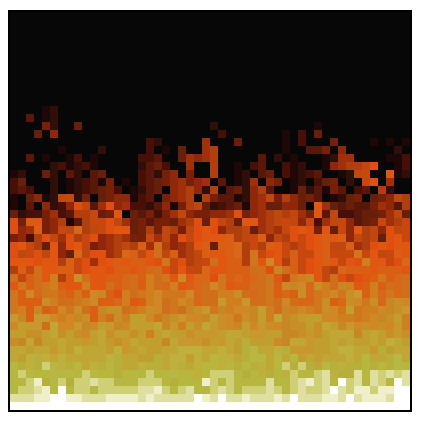

# Fire of Doom



This simple Javascript code does an amazing thing, renders the amazing fire of the Doom game in one div.
This code was based on the [Felipe Deschamps tutorial](https://www.youtube.com/watch?v=fxm8cadCqbs) code.

Give a star on my [repository](https://github.com/teckthor/fire-of-doom) :)

## How to start ?

````
1) Clone this repo.
2) Double click on the index.html ( See the magic )
````

Thanks for read :)